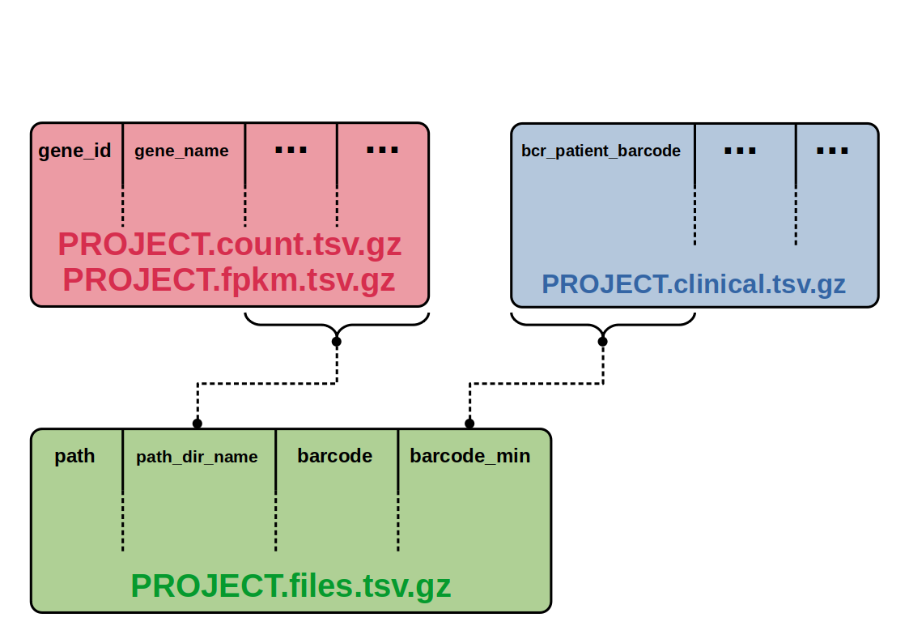

# Pre-requisites

- Install dplyr, readr, TCGAbiolinks and TCGAutils packages (R language)

# Usage (linux)

- Open both files and edit the project name (tcga_2023_download.R and tcga_2023_merge.R)

- Run the following script to download quantification data (fpkm and count) e clinical data (already merged)

```sh
  Rscript tcga_2023_download.R
```

- Merge quantification data

```sh
  Rscript tcga_2023_merge.R
```

# Usage (windows)

- Check your working directory (the downloaded files will be in this directory)

```R
  getwc()
```

- change project name in both files (tcga_2023_download.R and tcga_2023_merge.R)

- Run tcga_2023_download.R script in Rstudio

- Reset R session

- Run tcga_2023_merge.R script in Rstudio

# Obs

- this scripts was splited in two because of the memory usage.

- We recommend you to delete GDCdata directory and their files to free memory (only after merge the data). The output files (clinical, fpkm and count) are out of this directory.

# Output files


